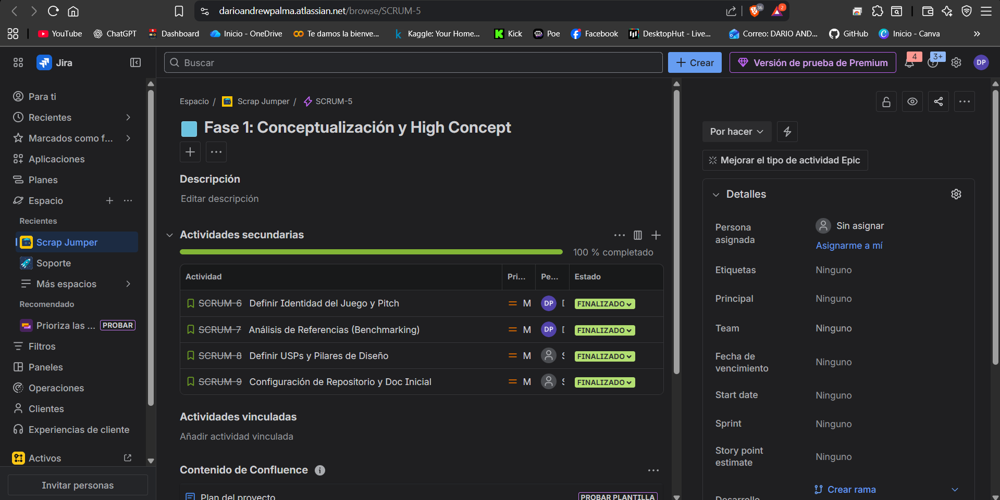

# 🏰 Documento de Diseño de Juego (GDD)
## Super Mario: The Infinite Tower

> **Versión:** Final 1.0  
> **Integrantes:** 
> 
> * Darío Palma
> * Ángel Cabezas  
> **Estado:** 🟢 Fase 1 Completada  

---

## 🚀 Fase 1: Conceptualización y Resumen Ejecutivo

### 1. 📄 Ficha Técnica del Proyecto

| Característica | Detalle |
| :--- | :--- |
| **Título** | **Super Mario: The Infinite Tower** |
| **Género** | Plataformas Vertical (Vertical Scroller) |
| **Plataforma** | PC / Web (Estilo Retro NES) |
| **Público Objetivo** | Jugadores nostálgicos y fans de los plataformas de precisión (Hardcore). |
| **Motor Gráfico** | Unity 2D / Godot / Babylon.js |

---

### 2. 💡 Resumen Ejecutivo (High Concept)

#### 📢 Elevator Pitch
> *"Es una reinvención del clásico **Super Mario Bros** mezclado con la adrenalina vertical de **Doodle Jump**. Bowser ha secuestrado a la Princesa Peach y la ha llevado a la cima de una torre infinita generada proceduralmente. La lava sube constantemente desde el suelo, obligando a Mario a escalar sin detenerse ni un segundo."*

#### 🔗 Referencia Conceptual ("X meets Y")
El juego se define como la fusión de:
* **Super Mario Bros:** Mecánicas de salto, físicas y estética 8-bits.
* **Ice Climber / Doodle Jump:** El objetivo es puramente vertical.

---

### 3. ⭐ Puntos Únicos de Venta (USPs)

1.  **🔥 Presión Constante (The Floor is Lava):** A diferencia del Mario clásico donde el tiempo es solo un número, aquí la amenaza es física. La lava sube continuamente y mata al instante, eliminando la opción de jugar pasivamente.

2.  **🏗️ Torre Procedural Infinita:** Nunca jugarás el mismo nivel dos veces. Los bloques, enemigos y plataformas se generan en patrones aleatorios, garantizando rejugabilidad infinita.

3.  **🏆 Sistema de Score Arcade:** El objetivo no es "ganar", sino sobrevivir. Se premia la recolección de monedas en situaciones de alto riesgo, fomentando la competencia por el *High Score*.

---

### 4. 📅 Gestión del Proyecto

La planificación de esta fase se ha realizado utilizando la metodología ágil **Scrum** en Jira Software.

**Evidencia del Tablero Jira (Sprint 1):**
> *En esta captura se visualizan las historias de usuario iniciales: Definición de Pitch, Análisis de Mercado y Configuración de Repositorio.*

---