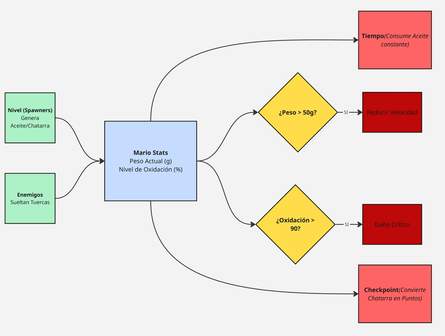
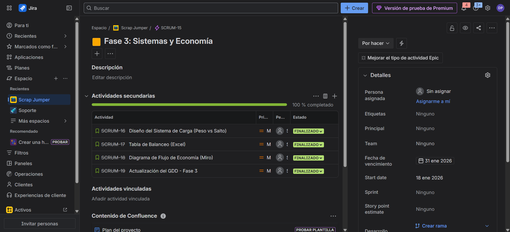

# 💰 Fase 3: Sistemas y Economía

## 1. ⚖️ Economía de Juego

El sistema se basa en el principio clásico de **"Riesgo vs Recompensa"**, obligando al jugador a tomar decisiones estratégicas en fracciones de segundo:

**🪙 Monedas (Puntos/Riesgo):**  
Las monedas suelen estar colocadas en los bordes de la pantalla o cerca de enemigos. El jugador debe decidir si arriesgarse a perder una vida por obtener mayor puntaje.

**❤️ Vidas (Supervivencia):**  
Es el recurso más valioso. Se pierden al contacto con enemigos o lava. La única forma de recuperarlas es mediante la recolección acumulativa de monedas (**100 Monedas = 1 Vida Extra**).

---

## 2. 🔄 Flujo de Recursos (Diagrama)

El siguiente esquema ilustra cómo ingresan los recursos al inventario del jugador (Inputs) y qué factores los consumen (Sinks), creando el equilibrio económico del juego.

> **Diagrama de Flujo:**  
> 

---

## 3. 📊 Tabla de Balanceo de Items

A continuación se definen los valores numéricos y efectos de los objetos interactivos para asegurar un juego justo:

| Sprite | Nombre       | Tipo        | Valor (Puntos) | Efecto en Gameplay                                      |
| :---:  | :---        | :---        | :---           | :---                                                    |
| 🪙     | **Moneda**   | Coleccionable | 200 pts    | Suma +1 al contador de canje de vida.                   |
| 🍄     | **Champiñón** | Power-Up     | 1000 pts   | **Mario crece:** Permite resistir un golpe extra sin morir. |
| ⭐     | **Estrella**  | Power-Up     | 5000 pts   | **Invencibilidad:** Otorga inmunidad temporal y elimina enemigos al contacto. |
| 👾     | **Goomba**    | Obstáculo    | 100 pts    | **Daño:** Mata a Mario al contacto lateral. Otorga puntos si se salta encima. |

---

