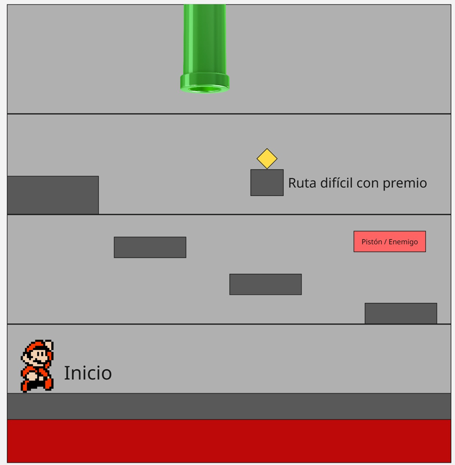
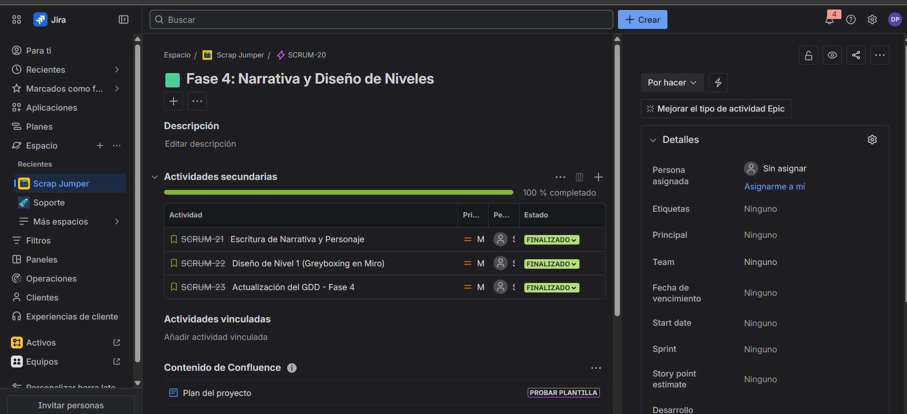

## 🏰 Fase 4: Narrativa y Diseño de Niveles

### 1. 📜 Sinopsis

Bowser ha construido una torre mecánica sobre el castillo de Peach. Mario entra para rescatarla, pero Bowser activa la trampa de "Lava Ascendente".

### 2. 🗺️ Diseño de Nivel: "World 1-Tower"

El nivel se diseña en 4 zonas de dificultad incremental:

**Zona 1 (Suelo):**
Lava hirviendo que empieza a subir. Plataformas seguras para aprender el salto.

**Zona 2 (Peligro):**
Aparecen los primeros Goombas y plataformas que se caen al pisarlas.

**Zona 3 (Decisión):**
Rutas divididas. Izquierda: camino fácil sin monedas. Derecha: camino difícil con muchas monedas.

**Zona 4 (Meta):**
La Tubería Verde de salida en la cima.

**Mapa del Nivel:**

