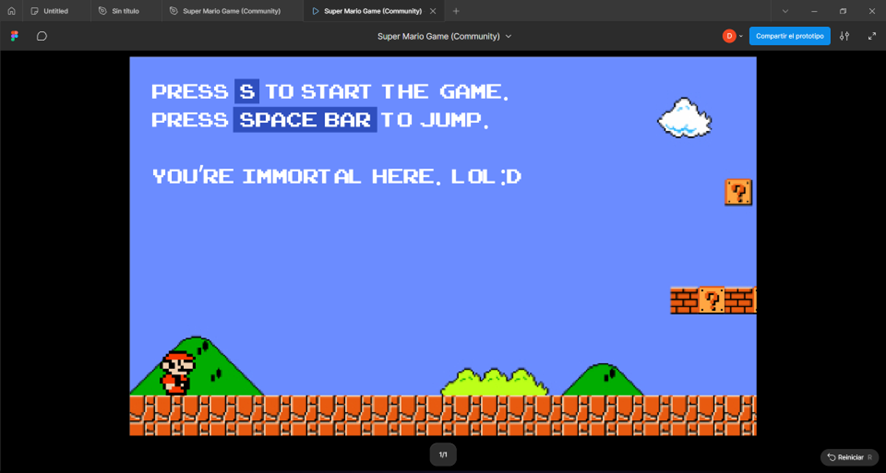
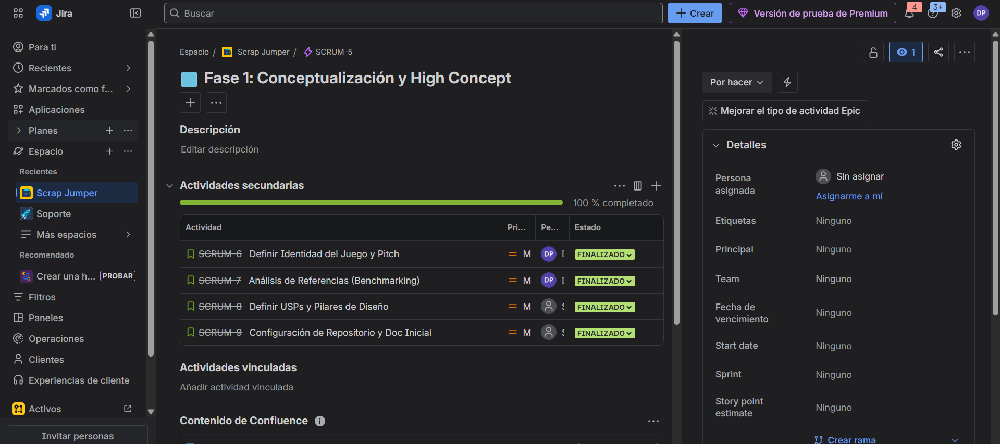

## 🎨 Fase 5: Estética y UI (Interfaz)

### 1. 🖌️ Estilo Visual

#### Pixel Art 8-Bits
Se respeta rigurosamente la paleta de colores de la NES (Nintendo Entertainment System) para evocar nostalgia.

#### Fondo
Gris/Azul plano para resaltar los elementos del primer plano.

#### Sprites
Originales de Nintendo (Mario, Goomba, Ladrillos).

#### Referencias Visuales

### 2. 🖥️ Interfaz de Usuario (HUD)

La interfaz es minimalista y se sitúa en la parte superior (Header), mostrando solo la información crítica para no tapar la acción vertical.

#### Elementos del HUD

* MARIO SCORE: Puntuación total.
* COINS (x00): Contador para vida extra.
* WORLD: Indicador de nivel.
* TIME: Tiempo restante antes de morir.

#### Mockup de UI

https://www.figma.com/design/fGVyCMacM4hgnGxTNE20Al/Super-Mario-Game--Community-?node-id=0-1&m=dev&t=IhzdvHxexTL3YSCW-1

