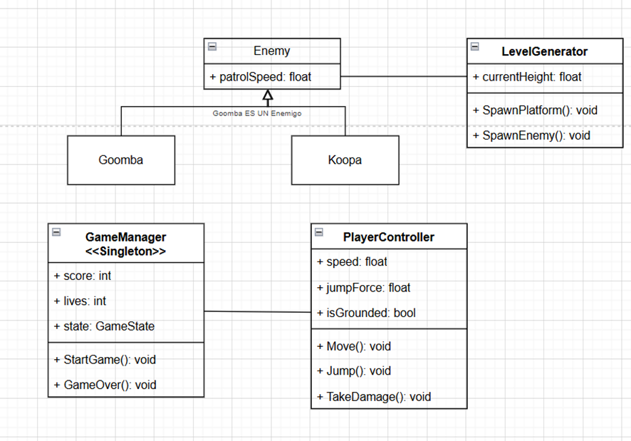
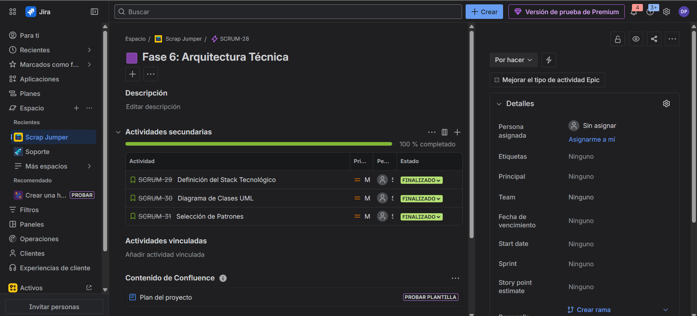
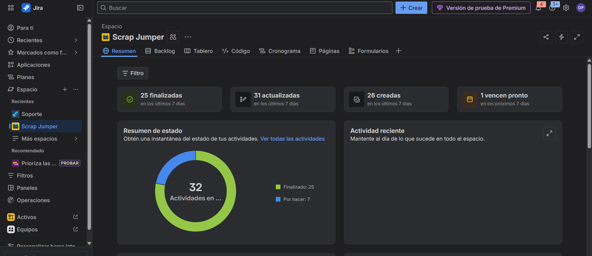

## ⚙️ Fase 6: Arquitectura Técnica

### 1. 💻 Stack Tecnológico

Hemos seleccionado un stack moderno basado en tecnologías web abiertas para garantizar la máxima accesibilidad.

#### Motor de Juego
**Babylon.js (v6.0+)**
Justificación: Motor de renderizado WebGL/WebGPU de alto rendimiento, ideal para juegos ligeros en navegador.

#### Lenguaje de Programación
**TypeScript**
Justificación: Proporciona tipado estático sobre JavaScript, lo que reduce errores en tiempo de ejecución y facilita la escalabilidad.

#### IDE (Entorno de Desarrollo)
Visual Studio Code.

#### Físicas
Cannon.js (Plugin integrado en Babylon) para detección de colisiones y gravedad.

#### Control de Versiones
Git / GitHub.

### 2. 🏗️ Arquitectura del Sistema

El juego sigue una arquitectura basada en Componentes dentro del ciclo de vida de Babylon (Scene -> Mesh -> Behavior).

#### Diagrama de Clases (UML Simplificado)
El siguiente diagrama muestra la relación entre el GameManager (Controlador global) y las entidades del juego.

### 3. 📐 Patrones de Diseño Seleccionados

#### Singleton (GameManager)
Se aplica a la clase GameManager para asegurar que solo exista una instancia que controle el Puntaje Global, el Tiempo y el Estado del Juego.

#### Observer (Event System)
Utilizamos `Babylon.Observable`. La UI escucha eventos (como la muerte de Mario) sin estar acoplada directamente a la lógica del jugador.

#### Factory Method (Generador de Niveles)
La clase `LevelGenerator` utiliza una factoría para instanciar (spawnear) dinámicamente plataformas y enemigos a medida que la cámara sube.

#### Game Loop
Nativo de Babylon (`engine.runRenderLoop`), donde se actualizan las lógicas de movimiento y físicas en cada frame (60 FPS).

