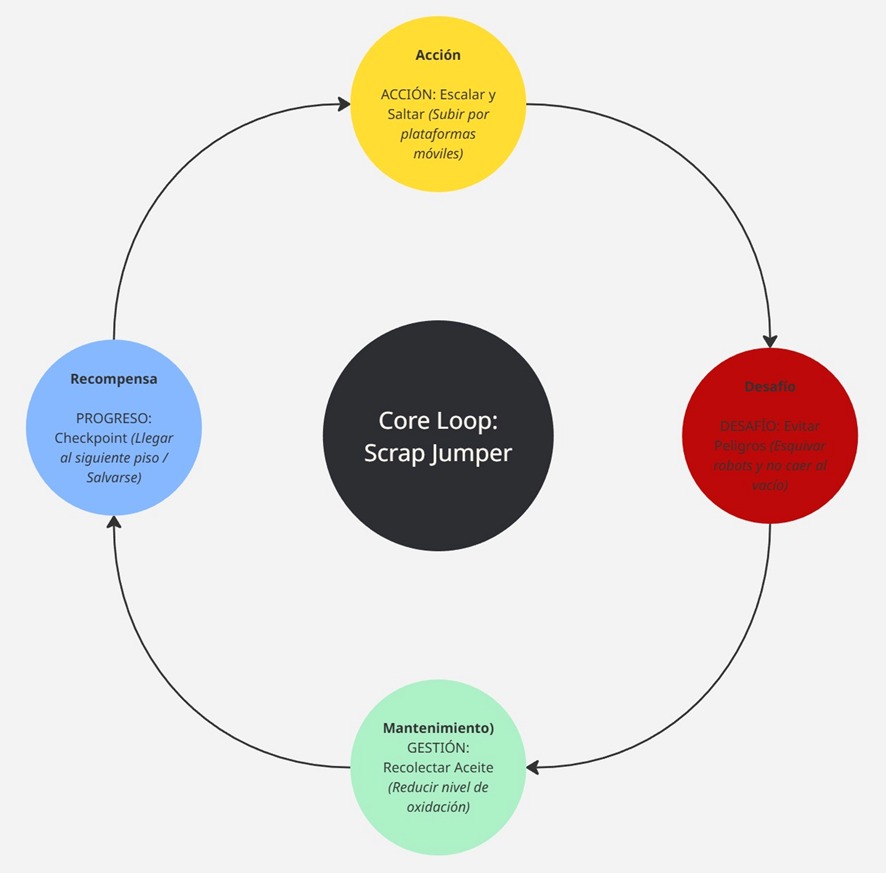
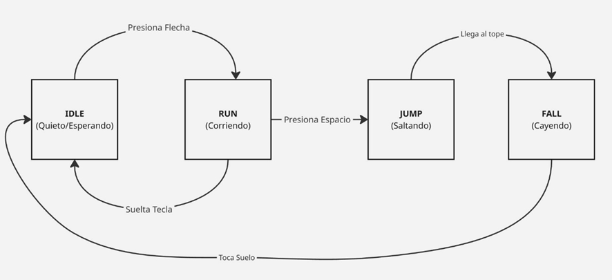
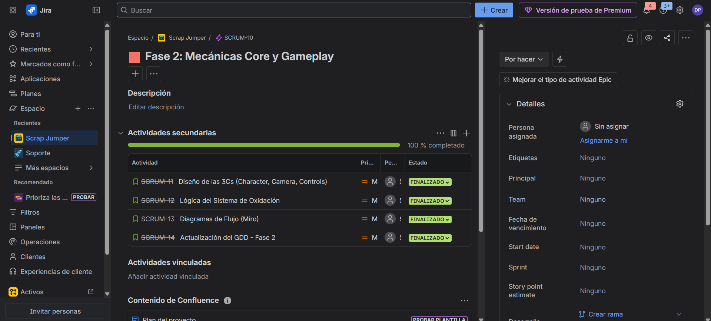

## 🎮 Fase 2: Mecánicas y Gameplay

### 1. 🔄 El Bucle de Juego (Core Loop)

El jugador se ve inmerso en un ciclo constante de 4 acciones clave que definen la experiencia de juego:

* **🧗 Saltar (Action):** Escalar verticalmente utilizando plataformas móviles y ladrillos rompibles.
* **🐢 Esquivar (Challenge):** Evitar patrones de enemigos (Koopas/Goombas) y no caer a la lava ascendente.
* **💰 Recolectar (Reward):** Arriesgarse para agarrar Monedas y Power-Ups en zonas difíciles.
* **🚩 Progresar:** Alcanzar el siguiente piso seguro o Checkpoint.

> **Diagrama del Core Loop:**
> 

---

### 2. 🕹️ Controles y Físicas

#### ⌨️ Esquema de Control (Input)

| Acción | Tecla / Input | Detalle |
| :--- | :--- | :--- |
| **Movimiento** | `⬅️` `➡️` (Flechas) | Mover a Mario lateralmente. |
| **Salto** | `Barra Espaciadora` | **Salto Variable:** La altura depende de cuánto tiempo se presione la tecla. |
| **Acción** | `Tecla S` | Sprint (Correr) o Disparar bolas de fuego (si tiene Flor). |

#### 📐 Especificaciones de Físicas
* **Gravedad Retro (NES):** Se implementa una caída rápida y pesada para imitar la sensación del juego original de 1985.
* **Coyote Time:** Se añade un margen de 0.1s para permitir saltar justo después de salir de una plataforma, mejorando la precisión y reduciendo la frustración.

---

### 3. 🤖 Máquina de Estados Finitos (FSM)

Para asegurar animaciones fluidas y evitar *bugs* de movimiento, Mario se rige por los siguientes estados:

1.  **Idle (Quieto):** Esperando input del jugador.
2.  **Run (Corriendo):** Desplazamiento horizontal con inercia.
3.  **Jump (Saltando):** Estado aéreo con velocidad vertical positiva.
4.  **Fall (Cayendo):** Estado aéreo con velocidad vertical negativa (gravedad aplicada).

> **Diagrama de Estados (FSM):**
> 

